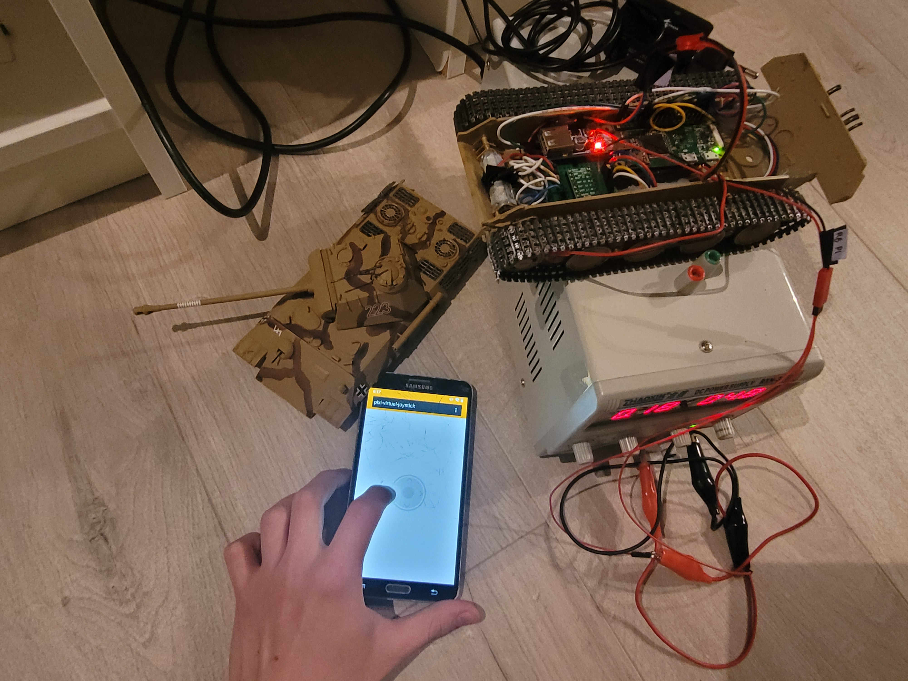

## Components:

* Servo EF90D 360 - micro: https://botland.store/micro-servos/17520-servo-ef90d-360-micro-with-wheel-and-tire-5904422327705.html
* 2x Li-Pol Akyga 750mAh 1S 3,7V: https://botland.store/battery-li-pol-1s-37-v/6033-akyga-li-pol-cell-750mah-1s-37v-connector-5904422364229.html
* Step-up converter 5V 1,2 A: https://botland.store/converters-step-up/3686-step-up-voltage-regulator-with-usb-socket-5v-12a-5903351241304.html
* Lipol charger: https://botland.store/charger-modules-for-li-po-batteries/6944-lipol-charger-tp4056-1s-37v-microusb-with.html
* 2x 100:1 DC motor: https://botland.store/pololu-micro-engines-lp-low-power/706-motor-with-100-1-gear-pololu-992-5904422305963.html
* Dual channel motor driver: https://botland.store/drivers-for-dc-motors/546-drv8833-two-channel-motor-controller-108v-12a-pololu-2130-5904422367213.html
* Raspberry Pi Zero WiFI (plus, any MicroSD card): https://botland.store/rpi-zero-modules-and-kits/8330-raspberry-pi-zero-w-wifi-bluetooth-512mb-ram-5904422311513.html

## Schematics:

